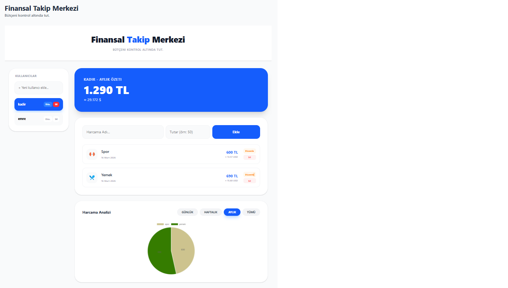

# Finansal Takip Merkezi 💰

"Finansal Takip Merkezi", kullanıcıların harcamalarını kolayca yönetebildiği, kategorize edebildiği ve grafiklerle analiz edebildiği modern bir finansal yönetim aracıdır.

## 📸 Uygulama Ekran Görüntüsü

## 🚀 Proje Hakkında
Bu proje, kişisel bütçe yönetimini dijitalleştirmek amacıyla React ve modern web teknolojileri kullanılarak geliştirilmiştir. Kullanıcılar kendi profillerini oluşturabilir, harcamalarını ekleyebilir ve anlık olarak bütçe durumlarını takip edebilirler.

## 🔗 Canlı Demo
Uygulamanın güncel haline hemen buradan ulaşabilirsiniz:
👉 [https://delicate-boba-47275e.netlify.app/](https://delicate-boba-47275e.netlify.app/)

## 🛠 Kullanılan Teknolojiler
* **React:** Kullanıcı arayüzü ve bileşen yapısı.
* **Vite:** Hızlı geliştirme ortamı ve derleme aracı.
* **Tailwind CSS:** Modern ve responsive tasarım.
* **LocalStorage:** Verilerin tarayıcıda kalıcı olarak saklanması.
* **Netlify:** Sürekli dağıtım (CI/CD) ve barındırma.

## 🌟 Temel Özellikler
* **Kullanıcı Yönetimi:** Birden fazla profil oluşturma ve yönetme.
* **Harcama Takibi:** Harcama adı ve tutar girerek listeye ekleme.
* **Dinamik Hesaplama:** Eklenen harcamaların TL ve USD bazında toplamını görüntüleme.
* **Görsel Analiz:** Harcama dağılımını gösteren interaktif grafikler.
